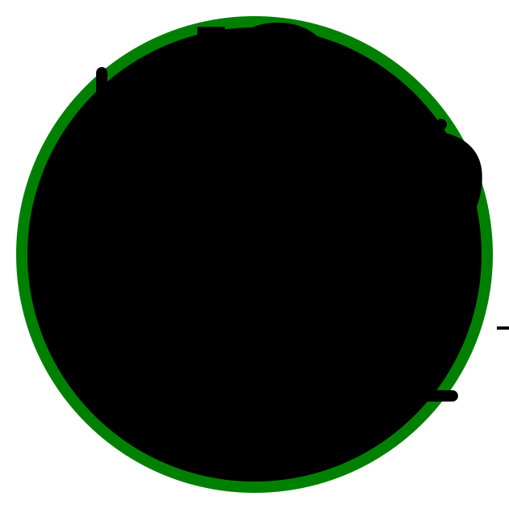

<p align="center">
    
</p>

# MathJSLab - [mathjslab.com](https://mathjslab.com/)

[](https://www.npmjs.com/package/mathjslab)
[](https://github.com/sergiolindau/mathjslab/blob/main/LICENSE)
[](https://www.npmjs.com/package/mathjslab)
[](https://unpkg.com/mathjslab/)
[](https://unpkg.com/mathjslab/)
[](https://unpkg.com/mathjslab/)
[](https://packagephobia.com/result?p=mathjslab)
[](https://github.com/sergiolindau/mathjslab-calculator)
[](https://doi.org/10.5281/zenodo.8396265)

> An interpreter with language syntax like [MATLAB&reg;](https://www.mathworks.com/)/[Octave](https://www.gnu.org/software/octave/) written in [Typescript](https://www.typescriptlang.org/).

**ISBN 978-65-00-82338-7**

This package emulates a parser and evaluator for a subset of
[MATLAB&reg;](https://www.mathworks.com/)/[Octave](https://www.gnu.org/software/octave/)
language. It is written completely in [Typescript](https://www.typescriptlang.org/).

The project page with a functional demo use of this package in a
[Web application](https://en.wikipedia.org/wiki/Web_application) can be found
at [mathjslab.com](https://mathjslab.com/). The repository is
[here](https://github.com/sergiolindau/mathjslab-calculator).

It can run in browser environment and implements an arbitrary precision
arithmetics using [decimal.js](https://www.npmjs.com/package/decimal.js)
package.

It uses the [ANTLR](https://www.antlr.org/)
[parser generator](https://en.wikipedia.org/wiki/Compiler-compiler) to
generate a [parser](https://en.wikipedia.org/wiki/Parsing) that create an
[AST](https://en.wikipedia.org/wiki/Abstract_syntax_tree)
([Abstract Syntax Tree](https://en.wikipedia.org/wiki/Abstract_syntax_tree)) of input.

Other components besides the [parser](https://en.wikipedia.org/wiki/Parsing)
are the evaluator, which computes the inputs, and the [MathML](https://www.w3.org/Math/)
unparser, that generates mathematical representations of the inputs and results.

This software is intended for **educational purposes**, to provide teachers and
students with a computer aided calculation tool that is capable of running in
a browser environment. So it can be easily adapted to be used on different devices
and environments.

## Features

- Runs on any [JavaScript](https://www.ecma-international.org/publications-and-standards/standards/ecma-262/) engine.
- Comes with a large set of built-in functions and constants.
- Is easily extensible through configuration parameters passed to Evaluator constructor.
- [Open source](https://en.wikipedia.org/wiki/Open-source_software) with fully documented code.
- Includes test suite using [Jest](https://jestjs.io/).
- Improved demo [Web application](https://en.wikipedia.org/wiki/Web_application) at project page: [mathjslab.com](https://mathjslab.com/).

## Browser support

**MathJSLab** works on any [ES2015](https://262.ecma-international.org/6.0/) compatible
[JavaScript](https://www.ecma-international.org/publications-and-standards/standards/ecma-262/)
engine, including [Node.js&reg;](https://nodejs.org/),
[Chrome](https://www.google.com/chrome/),
[Firefox](https://www.mozilla.org/en-US/firefox/),
[Safari](https://www.apple.com/safari/),
[Opera](https://www.opera.com),
and [Edge](https://www.microsoft.com/edge).

## Installation

Install the `mathjslab` package:

```bash
npm install mathjslab
```

## Usage

The basic API is an instantiation of `Evaluator` with optional configuration.

Import **MathJSLab API**:

```typescript
import { Evaluator, TEvaluatorConfig } from 'mathjslab';
```

Initialize evaluator with:

```typescript
let evaluator = new Evaluator(EvaluatorConfiguration);
```

### Examples:

* Parsing
```typescript
let input = evaluator.Parse('x=sqrt(1+2*3)');
```

* Evaluation
```typescript
let result = evaluator.Evaluate(input);
```

* MathML generation
```typescript
let mathmlInput = evaluator.UnparseMathML(input);
let mathmlResult = evaluator.UnparseMathML(result);
```

## Using UNPKG CDN

You can optimize your application, reducing the size of your bundle, loading
**MathJSLab** via the [UNPKG](https://www.unpkg.com/) [CDN](https://en.wikipedia.org/wiki/Content_delivery_network).

```html
<head>
    ...
    <script defer type="module" src="https://www.unpkg.com/mathjslab"></script>
    ...
</head>
```

The module will be loaded with `mathjslab` name. You can instantiate `Evaluator` with:

```typescript
let evaluator = new mathjslab.Evaluator(EvaluatorConfiguration);
```

## Contributing

To contribute to this project see our
[contributing guidelines](https://github.com/sergiolindau/mathjslab/blob/main/CONTRIBUTING.md).

Join the community chat:

[](https://matrix.to/#/#mathjslab:gitter.im?utm_source=badge&utm_medium=badge&utm_campaign=pr-badge&utm_content=badge)

## Build and Test

To build the project, you only need [Node.js&reg;](https://nodejs.org/) and the
[Java Runtime Environment](https://www.oracle.com/java/) installed. The project
dependencies are managed by npm. The build scripts download the latest version
of ANTLR into the resources directory for use by the project. Before building
and testing the project, run:

```bash
npm install
npm run update
```

This will install the dependencies, update all of them, and download the latest version of ANTLR, preparing any resources needed to build the project.

Run the `mathjslab` tests:

```bash
npm run test
```

Build `mathjslab`:

```bash
npm run build
```

## Language subset

Currently only the mathematical expressions of the language are implemented. The control and loop structures are not yet implemented.

There are some differences from the original [MATLAB&reg;](https://www.mathworks.com/)/[Octave](https://www.gnu.org/software/octave/). The main difference is
that there are only one a complex numeric type. Other implemented types is
boolean, character string, structure and function handle.

Common arrays (not only cell arrays) can hold any type of element.

## License

>MIT License
>
>Copyright &copy; 2016-2024 [Sergio Lindau](mailto:sergiolindau@gmail.com), [mathjslab.com](https://mathjslab.com/), ISBN 978-65-00-82338-7.
>
>Permission is hereby granted, free of charge, to any person obtaining a copy
>of this software and associated documentation files (the "Software"), to deal
>in the Software without restriction, including without limitation the rights
>to use, copy, modify, merge, publish, distribute, sublicense, and/or sell
>copies of the Software, and to permit persons to whom the Software is
>furnished to do so, subject to the following conditions:
>
>The above copyright notice and this permission notice shall be included in all
>copies or substantial portions of the Software.
>
>THE SOFTWARE IS PROVIDED "AS IS", WITHOUT WARRANTY OF ANY KIND, EXPRESS OR
>IMPLIED, INCLUDING BUT NOT LIMITED TO THE WARRANTIES OF MERCHANTABILITY,
>FITNESS FOR A PARTICULAR PURPOSE AND NONINFRINGEMENT. IN NO EVENT SHALL THE
>AUTHORS OR COPYRIGHT HOLDERS BE LIABLE FOR ANY CLAIM, DAMAGES OR OTHER
>LIABILITY, WHETHER IN AN ACTION OF CONTRACT, TORT OR OTHERWISE, ARISING FROM,
>OUT OF OR IN CONNECTION WITH THE SOFTWARE OR THE USE OR OTHER DEALINGS IN THE
>SOFTWARE.
